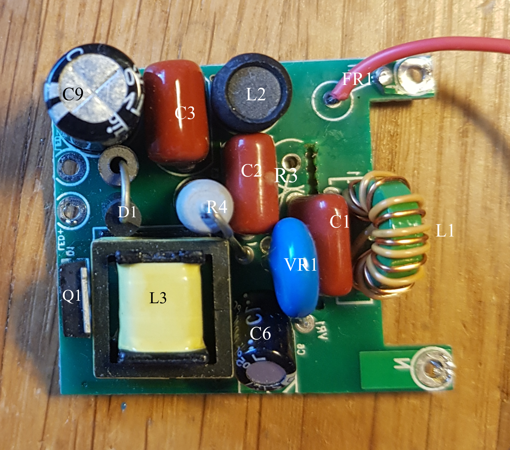
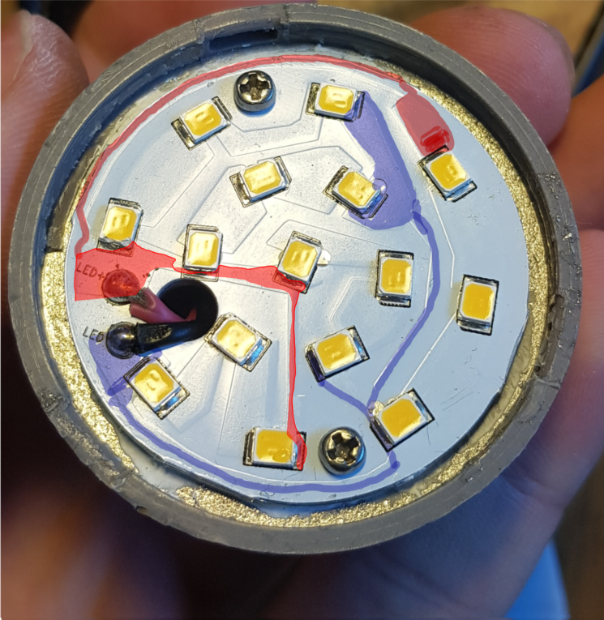
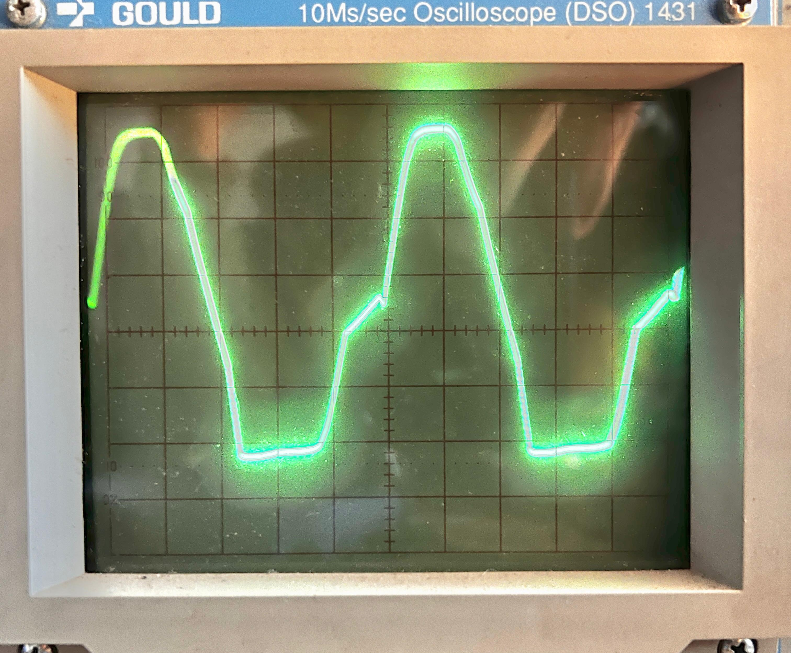

# Dimmable LED driver analysis
The situation: I bought several LED spots called "Nova Plus" by the company Paulmann.   
(https://de.paulmann.com/p/led-modul-einbauleuchte-nova-plus-coin-rund-50mm-coin-6w-470lm-230v-dimmbar-2700k-satin/93078)

The lights are rated for 6W and intended for use with a dimmer, but many of them stopped working. Time for investigations.

## Driver PCB

Main goal: create schematic from scratch and understand how things work. Ideally fix the broken units.  
The IC is a `iW3688` by Renesas. It supports leading and trailing edge dimming. The `-01` variant found here supports 230VAC input with up to 14 W output power.  
(https://www.renesas.com/en/document/prb/iw3688-product-summary?r=1543101)

For most defective units the only apparent damage was the blown fusible resistor. All the other simple components seemed fine.  
The state of the main IC could not be assessed due to lack of information and tooling.

  
(mirrored)

### Schematic

The schematic turned out to be very similar to the example in the production summary.

## Failure analysis
TBD  

## LED PCB

The seperate pcb with the actual LEDs contains 15 SMD LEDs in total. Five strings of each 3 LEDs in series.  
The package form is 2835 (2,8 x 3,5mm).
While 'usual' white LEDs work in the ~3V range these turn on at about 15 V.

None of the defective units had failed LEDs. Assuming a single SMD LED failed, the two remaining strings will be loaded 50 % more and soon overheat. This is due to the constant-current driving mechanism of LED drivers. 

## Extending LED lifetime

It is common for LED drivers to 'push' too much current through the LEDs. As a result they get hot and the lifetime shortens. For many (cheap) lights this is a very common failure mode.  
In this case though the LEDs are still working. Nevertheless, investigating how to modify the drivers behaviour is at least interesting.

The used IC has several resistors for configuring behaviour, one of them ($R_{14} || R_{15}$) is used to set the current to power the LEDs ($I_{LED}$) 

In the table below are measurements comparing the stock configuration with a modified one.
- $U_{LED}$:    Average DC voltage measured across LEDs
- $I_{LED}$:    Average DC current flowing through LEDs
- $R_{sense}$:  Resistor for defining $I_{LED}$. It is consists of $R_{14}$ and $R_{15}$ in parallel

|       |   $U_{LED}$ [V]       |  $I_{LED}$ [mA]   |   $R_{sense}$ [Ohm]   |
|   --- |   ---                 |   ---             |   ---                 |
| stock |   52                  |   101             |   1,5                 |
| mod   |   50                  |   50              |   3,1                 |

Therefore the correlation  $I_{LED} \propto 1/R_{sense} $  holds. This is common for LED drivers.

## Possible further investigations
Unfortunately a full datasheet of the `iW3688` IC by Renesas is not available, only [this production summary](https://www.renesas.com/en/document/prb/iw3688-product-summary?r=1543101). Thus further analysis is hardly possible. 

### Precise measurement of $U_{LED}$

All measurements above were done with a simple digital multimeter (DMM).  
Probing the output voltage relative to earth with an oscilloscope led to the following graph:    

Zero volts reference is at the bottom of the screen.
The units are:
- 20 V / div. vertically
- 20 ms / div. horizontally  

#### Observations:
The base frequency is 50 Hz, although for a full bridge rectifier it should be double that.

#### Why this measurement was not very useful:
Neither do I own an isolation transformer nor differential probes. Thus the point of reference (neg. LED terminal) (might be?) swinging as well. *I think* this could be solved by using a second probe (which I do not have) and subtracting the signals.

Working on mains voltage with an unisolated powersupply is dangerous anyway. Don't do it.
